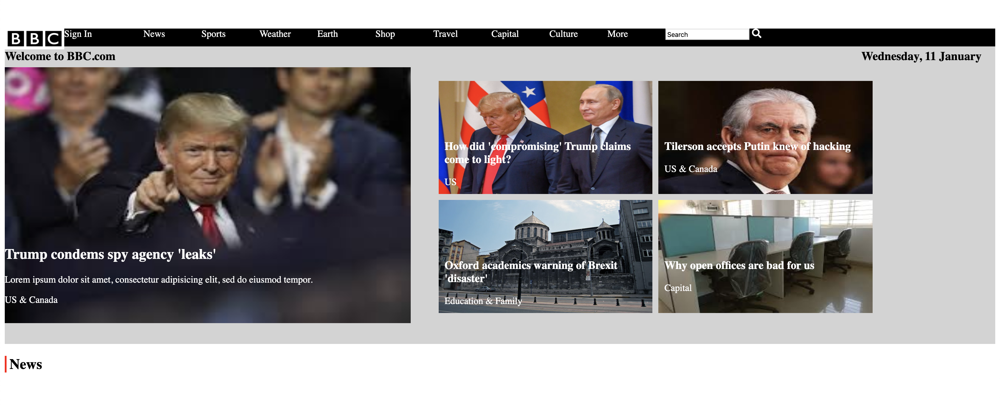

# BBC

A recreation of a BBC website.

## Link to online version:  

https://zikrebbc.netlify.com/

## Tech Used: HTML & CSS

This recreation was made using HTML & CSS

## Lessons Learned:

This was a site I was proud to make responsive.It marked the beginning of me understanding how to tackle responsiveness.

## Examples:

https://github.com/zikrehaimanot/calculator

https://github.com/zikrehaimanot/rpsGame

https://github.com/zikrehaimanot/foodist

https://github.com/zikrehaimanot/fizzbuzz

https://github.com/zikrehaimanot/slot-machine-2019-week05/tree/answer
